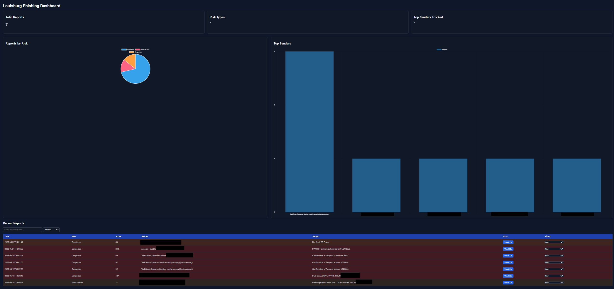

# Phishing Email Analyzer


A Gmail-integrated phishing detection and incident response platform built with:

- FastAPI
- Gmail Add-ons
- SQLite
- VirusTotal API
- Chart.js
- Google Apps Script

Designed to help library staff quickly analyze suspicious emails, extract indicators of compromise (IOCs), and manage phishing investigations through a centralized SOC-style dashboard.

---

# Features

## Gmail Add-on Integration
- Analyze suspicious emails directly inside Gmail
- One-click phishing reporting
- Risk scoring and verdict display

## Phishing Detection Engine
Detects:
- SPF failures
- DKIM issues
- suspicious keywords
- URL shorteners
- non-HTTPS links
- malicious URLs via VirusTotal
- suspicious attachments
- phishing indicators in headers

## IOC Extraction
Extracts:
- URLs
- attachment filenames
- message IDs
- sender details

## Analyst Dashboard
Interactive dashboard with:
- Dark mode UI
- Auto-refresh
- Search and filtering
- IOC modal viewer
- Risk charts
- Top sender tracking
- Analyst workflow statuses

## Analyst Workflow
Track reports as:
- New
- Reviewed
- False Positive
- Confirmed Malicious

## Security
- API key authentication
- Protected backend endpoints
- Dashboard-ready architecture

---

# Screenshots



```text
/dashboard screenshot
IOC modal screenshot
Gmail add-on screenshot
```

---

# Architecture

```text
Gmail Add-on
       |
       v
Google Apps Script
       |
       v
FastAPI Backend
       |
       +--> VirusTotal API
       |
       +--> SQLite Database
       |
       +--> Dashboard UI
```

---

# Tech Stack

## Backend
- Python
- FastAPI
- Uvicorn

## Frontend
- HTML
- CSS
- JavaScript
- Chart.js

## Integrations
- Gmail API
- Google Apps Script
- VirusTotal API

## Database
- SQLite

## Deployment
- Render
- ngrok (development)

---

# Installation

## Clone Repository

```bash
git clone https://github.com/YOUR_USERNAME/phishing-email-analyzer.git
cd phishing-email-analyzer
```

## Create Virtual Environment

```bash
python -m venv venv
```

## Activate Virtual Environment

### Windows

```bash
.\venv\Scripts\activate
```

### Linux/Mac

```bash
source venv/bin/activate
```

## Install Dependencies

```bash
pip install -r requirements.txt
```

---

# Environment Variables

Create a `.env` file:

```env
VIRUSTOTAL_API_KEY=your_key_here
PHISHING_API_KEY=your_api_key_here
```

---

# Run the Application

```bash
uvicorn main:app --reload
```

Open:

```text
http://127.0.0.1:8000/dashboard
```

---

# Gmail Add-on Setup

1. Open Google Apps Script
2. Create Gmail Add-on project
3. Add `Code.gs`
4. Configure manifest
5. Deploy test add-on
6. Connect to FastAPI backend

---

# API Endpoints

## Analyze Email

```http
POST /analyze
```

## Report Phishing

```http
POST /report
```

## IOC Retrieval

```http
GET /api/report/{id}/iocs
```

## Update Analyst Status

```http
POST /api/report/{id}/status
```

## Dashboard

```http
GET /dashboard
```

---

# Dashboard Features

## Charts
- Reports by risk level
- Top senders

## Search & Filtering
- Sender filtering
- Subject filtering
- Risk filtering

## IOC Viewer
Displays:
- URLs
- attachments
- message metadata

---

# Future Improvements

---

# License

MIT License

---

# Author

Rusty Folsom

Louisburg Library IT / Cybersecurity

---

# Disclaimer

This project is intended for educational, defensive, and internal security operations purposes only.
